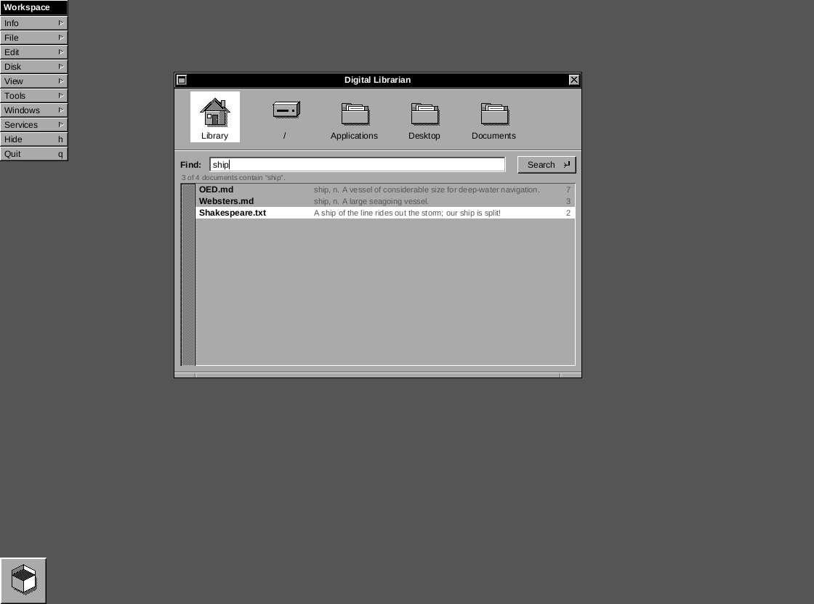
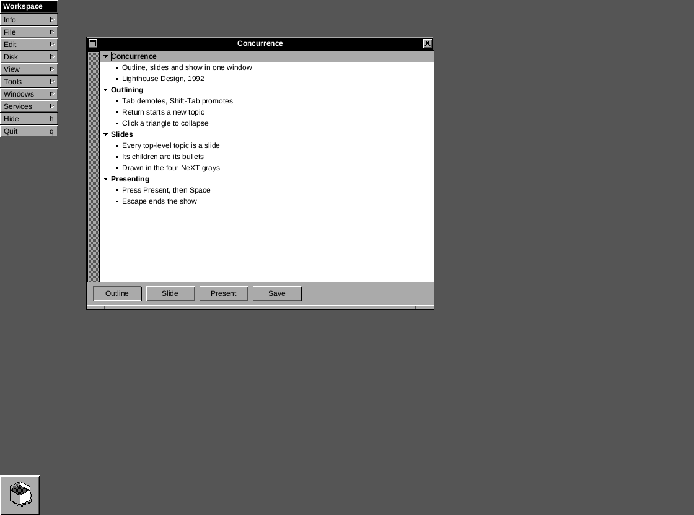
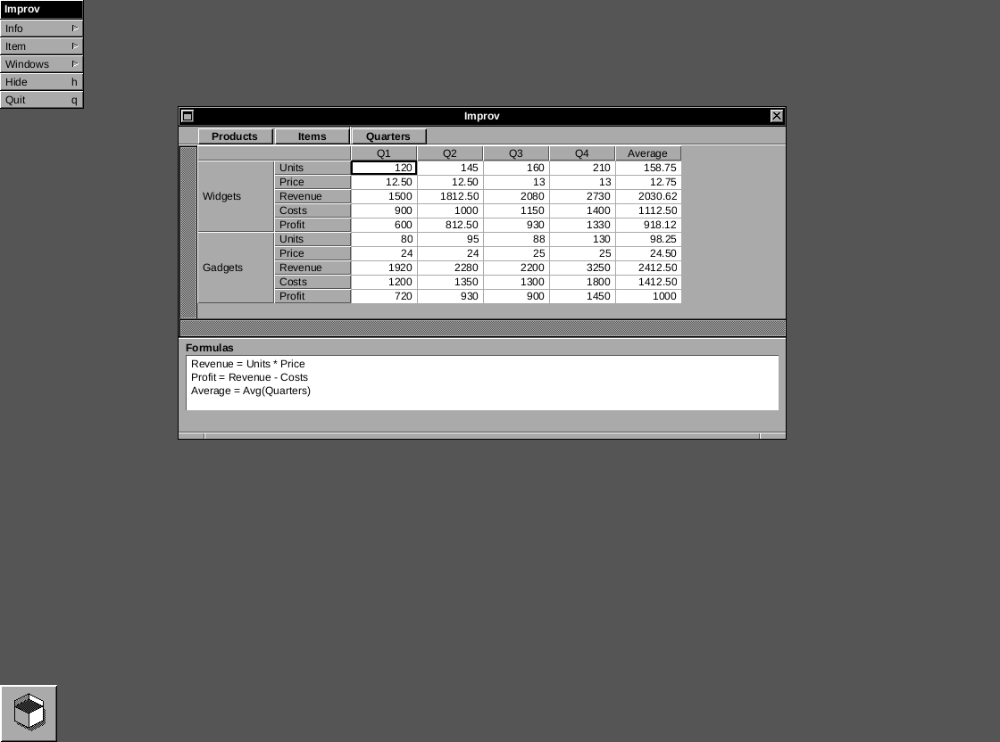

# ReWorkspace

A native, single-binary recreation of the **look** of early NeXTSTEP (the 2.0 release of 1990, with
1.0's window chrome) — Workspace Manager, vertical menus, Dock, Recycler — running on your desktop
on macOS and Windows, in the spirit of [ReProgman](https://github.com/mayuki/ReProgman).

It is written in Rust and draws every pixel itself (no webview, no GPU, no UI toolkit). There is
no container window: the File Viewer, Inspector, menus, Dock tiles and Recycler are real
undecorated windows on your desktop, painted by our own software renderer, so they sit among
your other applications. It is not a picture: the File Viewer browses your real disk, double-click
opens files with the host OS, the Dock launches real applications, and dragging a file to the
Recycler moves it to the system trash. `View ▸ Screen Backdrop` adds the dark NeXT screen behind
everything if you want the full illusion.


At 2× (`View ▸ Scale ▸ 2×`):


> ReWorkspace is an original recreation of a *style*. It is not affiliated with, endorsed by, or
> derived from NeXT, Apple, or the GNUstep project. No artwork, fonts, or code from NeXTSTEP,
> OPENSTEP, macOS or GNUstep is included; every icon is an original drawing in the grayscale,
> dither-shaded idiom of the period.

## Download & run

Builds are attached to [GitHub Releases](../../releases). Nothing is installed system-wide and
no administrator rights are needed; quit at any time.

**macOS (Apple Silicon)** — the app is not notarized. After copying `ReWorkspace.app` out of the
DMG, clear the quarantine flag once, exactly as ReProgman documents it:

```sh
xattr -cr /Applications/ReWorkspace.app
```

**Windows (x64, arm64)** — `ReWorkspace-portable-*.exe` is the whole program; run it from anywhere.

`View ▸ Scale` offers 1×, 1.5× and 2×; any factor works from the command line, for example
`reworkspace --scale 1.25` (0.5 to 4, not saved unless you then pick a menu item). Text and icons
are re-rasterized at the new size, so nothing is upscaled bitmaps.

State lives in one file: `~/Library/Application Support/ReWorkspace/state.json` (macOS) or
`%APPDATA%\ReWorkspace\state.json` (Windows). Delete it to start fresh. A corrupt file is renamed
to `state.json.bad` and defaults are used (the Console says so).

## What works

- File Viewer in the 2.0 layout: Shelf with free-space line, Icon Path aligned above the browser
  columns with the column scroller beneath it, browser columns with their own scroller strips,
  keyboard navigation (arrows, Enter, Delete, type-ahead), hidden-file toggle, live refresh every 5 s.
- Inspector: attributes, folder size on demand, text and PNG contents.
- Dock (off by default, `View ▸ Show Dock`): default host apps (Terminal/TextEdit/Safari or
  Notepad/Calculator/Edge) with their real icons, launch on click, drag to reorder, drag off to
  remove, drop an app to add, drop a file on a tile to open it with that app.
- Recycler: Delete key or drop onto the tile (`View ▸ Show Recycler Tile`, off by default) to
  trash, contents window (`Windows ▸ Recycler`), `File ▸ Empty Recycler` (always confirms).
- Miniwindows: `View ▸ Show Miniwindows` (off by default) shows NeXT-style tiles for miniaturized
  windows; otherwise a miniaturized window just hides until reopened from the menus.
- Menus: full Workspace menu tree, submenus, tear-off menus that persist, key equivalents
  (Cmd on macOS, Ctrl on Windows), right-click main menu on the background. The main menu belongs
  to the key window's application, as on NeXTSTEP: while the Improv or Concurrence window is key
  the menu is that application's, and it goes back to Workspace's when another window takes over.
- Help: `Info ▸ Help…` (Cmd-?) opens a panel with a page for whichever window is key — the
  Workspace, Inspector, Console, Recycler, Shell, Librarian, Mandelbrot, Improv or Concurrence —
  listing what that application's keys and clicks do.
- Shell (`Tools ▸ Shell…`, Cmd-T): a real terminal running your login shell, emulated by
  `alacritty_terminal` and drawn in the four grays with a block cursor and scrollback on our
  left-side scroller. Resize the window to change the grid; the window title follows the shell's.
- Digital Librarian (`Tools ▸ Librarian…`, Cmd-L), after the 1990 full-text search tool: the Shelf
  doubles as the bookshelf — click the folders to search (the home folder starts selected), type a
  word and press Return. Text documents are ranked by how often the word occurs, with the first
  matching line beside each; double-click opens the document. It greps on a background thread
  instead of pre-building an index, and stops after 4000 documents or 300 hits.

  
- Mandelbrot (`Tools ▸ Mandelbrot…`), after the 1.0 demo: the set in four grays with four dithering
  modes (ordered, knight's tour, noise mix, error diffusion), click / shift-click / rubber-band zoom,
  depth control, and Save to a PNG in your home folder.

  
- Concurrence (`Tools ▸ Concurrence…`), after Lighthouse Design's outliner and presenter: one
  document seen three ways. **Outline** edits topics in place (Tab demotes a topic with its whole
  subtree, Shift-Tab promotes it, Return splits one, click a triangle to collapse it); **Slide**
  draws the current topic as a 4:3 slide — every top-level topic is a slide, its children are its
  bullets; **Present** takes the whole Screen, a white slide on black with the menu, Dock and tiles
  out of the way, driven by Space, the arrow keys or a click, and Escape (or advancing past the last
  slide) ends the show. While its window is key the main menu is Concurrence's: `Topics ▸ Move ▸
  Move Left` (Cmd-[) and `Move Right` (Cmd-]) are the real application's promote and demote, which
  its manual documents Tab and Shift-Tab as shortcuts for; `View ▸ Outline`,
  `Slide` and `Present` (Cmd-P) do what the buttons do, and `Save` (Cmd-S) writes the outline as
  `Presentation-N.txt` in your home folder; the outline itself lives in `state.json`.

  
- Improv (`Tools ▸ Improv…`), after Lotus Improv (NeXT, 1991): a multi-dimensional worksheet with no
  A1/B2 anywhere. The data is a cube of named categories (Products × Items × Quarters); formulas are
  written in plain English over the item names — `Revenue = Units * Price` — and apply to every cell
  of that item; the category tiles in the bar at the top are dragged between the row zone and the
  column zone to pivot the view. Click a cell and type to enter a figure, click a formula to edit it,
  and click the empty line under the formulas to write another. While the window is key the main
  menu is Improv's: `Item ▸ New Row` and `New Column` add an item to the innermost category of that
  zone and open its header for typing; `Delete Row` and `Delete Column` take the one the selection
  is in, figures and all. Click a row or column header to pick it, click the one already picked to
  rename it. The sheet has a scroller down its left edge and another along the bottom — the headers
  scroll with it, the arrow keys keep the selected cell in view, and both slots go empty when the
  whole worksheet fits.
  Formulas have `+ - * / ( )`, the comparisons `< > = <= >= <>`, and the functions `Sum`, `Avg`,
  `Min`, `Max`, `Count`, `Round`, `Abs`, `Int`, `Sqrt` and `If`. A category name as an argument
  brings one figure per item, so `Average = Avg(Quarters)` averages each row across the quarters
  (leaving its own cell out); everything else is one value, as in `Max(Units, Price)`. The
  worksheet — categories, figures and formulas — lives in `state.json` and comes back on the next
  launch.

  
- Persistence of window, menu, Dock, Shelf, backdrop, tile visibility and scale settings.

## Known limitations

- **Hide** is available on macOS. On Windows, the menu item and Ctrl-H shortcut are disabled.
- **Windows Recycle Bin** is not a plain folder, so the Recycler window offers an *Open Recycle
  Bin* button instead of a listing and `Empty Recycler` is disabled.
- **macOS Trash listing** needs *Full Disk Access* (System Settings ▸ Privacy & Security). Without
  it, moving files to the Recycler still works, but the Recycler window cannot list `~/.Trash`
  and shows an *Open in Finder* button instead.
- Dock tiles always show the "not running" dots (except Workspace): host app state is not tracked.
- Windows app icons are extracted at 32 px and scaled; the Windows build has no embedded exe icon
  and no installer.
- Browser view only (no Icon or Listing view), no Preferences. Inspector images: PNG only.
- Librarian: whole-word/phrase substring search over text and source files only (by extension), no
  index, no Boolean or proximity operators, no in-document highlighting.
- Concurrence: one line per bullet (long ones are ellipsized, not wrapped), no styles, images, charts
  or per-slide layouts, no undo, and no document files — Save exports the outline, there is no Open.
- Shell: no copy and paste or mouse selection yet; colors are mapped onto the four grays; on Windows,
  Ctrl shortcuts go to the shell while it is the key window.
- Improv: item names used in formulas must be single words; no number formats and no undo;
  categories themselves cannot be added, removed or renamed (their items can), so a worksheet
  starts from the sample three. `If`
  evaluates both of its branches, deleting an item leaves any formula that named it behind with its
  error, and a cell claimed by two formulas takes the value of the later one, with no conflict
  marker.
- Without the backdrop there is no right-click main menu (nothing of ours to click on the desktop).

## Development

```sh
cargo run                     # debug build
cargo test && cargo clippy --all-targets
scripts/bundle-macos.sh       # release .app + .dmg in dist/ (macOS)
cargo build --release         # Windows: target/release/reworkspace.exe is the portable build
```

Look-review and tests run headlessly, without a display:

```sh
cargo run -- --demo chrome --headless script.txt --out shots/    # bevel/font/icon test screen
cargo run -- --home /tmp/fakehome --config /tmp/cfg --headless script.txt --out shots/
```

A script is one command per line: `size W H`, `click X Y`, `rclick X Y`, `dblclick X Y`,
`drag X1 Y1 X2 Y2` … `drop`, `dragsel X Y` (from the selected cell), `key up|down|left|right|enter|esc|del|<char>`,
`type text`, `mods [cmd] [shift] [alt]`, `wheel DX DY`, `wait MS`, `zoom 1|2`, `shot name.png`,
`eval title|cols|selection|dock|shelf|menus|key|lib|state`, `log N`. Every screenshot in
`docs/screenshots` was produced this way.

See `docs/PRD.md` for the specification, `docs/DECISIONS.md` for deviations from it (including
the native rewrite), and `THIRD_PARTY_LICENSES.md` for bundled components (Liberation fonts, OFL 1.1).
