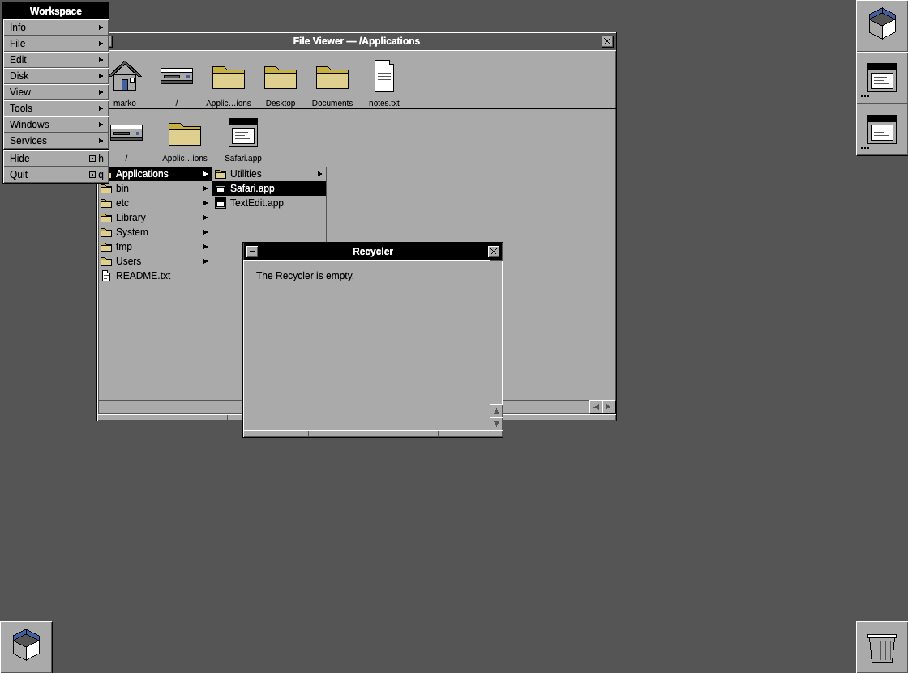
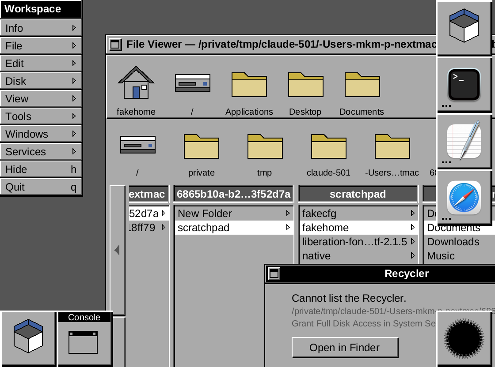
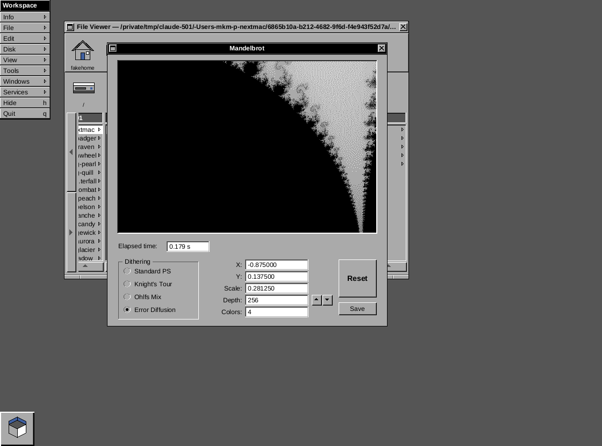

# ReWorkspace

A native, single-binary recreation of the **look** of early NeXTSTEP (the 2.0 release of 1990, with
1.0's window chrome) — Workspace Manager, vertical menus, Dock, Recycler — running on your desktop
on macOS and Windows, in the spirit of [ReProgman](https://github.com/mayuki/ReProgman).

It is written in Rust and draws every pixel itself (no webview, no GPU, no UI toolkit). There is
no container window: the File Viewer, Inspector, menus, Dock tiles and Recycler are real
undecorated windows on your desktop, painted by our own software renderer, so they sit among
your other applications. It is not a picture: the File Viewer browses your real disk, double-click
opens files with the host OS, the Dock launches real applications, and dragging a file to the
Recycler moves it to the system trash. `View ▸ Screen Backdrop` adds the dark NeXT screen behind
everything if you want the full illusion.



At 2× (`View ▸ Scale ▸ 2×`):



> ReWorkspace is an original recreation of a *style*. It is not affiliated with, endorsed by, or
> derived from NeXT, Apple, or the GNUstep project. No artwork, fonts, or code from NeXTSTEP,
> OPENSTEP, macOS or GNUstep is included; every icon is an original drawing in the grayscale,
> dither-shaded idiom of the period.

## Download & run

Builds are attached to [GitHub Releases](../../releases). Nothing is installed system-wide and
no administrator rights are needed; quit at any time.

**macOS (Apple Silicon)** — the app is not notarized. After copying `ReWorkspace.app` out of the
DMG, clear the quarantine flag once, exactly as ReProgman documents it:

```sh
xattr -cr /Applications/ReWorkspace.app
```

**Windows (x64, arm64)** — `ReWorkspace-portable-*.exe` is the whole program; run it from anywhere.

State lives in one file: `~/Library/Application Support/ReWorkspace/state.json` (macOS) or
`%APPDATA%\ReWorkspace\state.json` (Windows). Delete it to start fresh. A corrupt file is renamed
to `state.json.bad` and defaults are used (the Console says so).

## What works

- File Viewer in the 2.0 layout: Shelf with free-space line, Icon Path aligned above the browser
  columns with the column scroller beneath it, browser columns with their own scroller strips,
  keyboard navigation (arrows, Enter, Delete, type-ahead), hidden-file toggle, live refresh every 5 s.
- Inspector: attributes, folder size on demand, text and PNG contents.
- Dock (off by default, `View ▸ Show Dock`): default host apps (Terminal/TextEdit/Safari or
  Notepad/Calculator/Edge) with their real icons, launch on click, drag to reorder, drag off to
  remove, drop an app to add, drop a file on a tile to open it with that app.
- Recycler: Delete key or drop onto the tile (`View ▸ Show Recycler Tile`, off by default) to
  trash, contents window (`Windows ▸ Recycler`), `File ▸ Empty Recycler` (always confirms).
- Miniwindows: `View ▸ Show Miniwindows` (off by default) shows NeXT-style tiles for miniaturized
  windows; otherwise a miniaturized window just hides until reopened from the menus.
- Menus: full Workspace menu tree, submenus, tear-off menus that persist, key equivalents
  (Cmd on macOS, Ctrl on Windows), right-click main menu on the background.
- Shell (`Tools ▸ Shell…`, Cmd-T): a real terminal running your login shell, emulated by
  `alacritty_terminal` and drawn in the four grays with a block cursor and scrollback on our
  left-side scroller. Resize the window to change the grid; the window title follows the shell's.
- Mandelbrot (`Tools ▸ Mandelbrot…`), after the 1.0 demo: the set in four grays with four dithering
  modes (ordered, knight's tour, noise mix, error diffusion), click / shift-click / rubber-band zoom,
  depth control, and Save to a PNG in your home folder.

  
- Persistence of window, menu, Dock, Shelf, backdrop, tile visibility and scale settings.

## Known limitations

- **Windows Recycle Bin** is not a plain folder, so the Recycler window offers an *Open Recycle
  Bin* button instead of a listing and `Empty Recycler` is disabled.
- **macOS Trash listing** needs *Full Disk Access* (System Settings ▸ Privacy & Security). Without
  it, moving files to the Recycler still works, but the Recycler window cannot list `~/.Trash`
  and shows an *Open in Finder* button instead.
- Dock tiles always show the "not running" dots (except Workspace): host app state is not tracked.
- Windows app icons are extracted at 32 px and scaled; the Windows build has no embedded exe icon
  and no installer.
- Browser view only (no Icon or Listing view), no Preferences, no search. Inspector images: PNG only.
- Shell: no copy and paste or mouse selection yet; colors are mapped onto the four grays; on Windows,
  Ctrl shortcuts go to the shell while it is the key window.
- Without the backdrop there is no right-click main menu (nothing of ours to click on the desktop).

## Development

```sh
cargo run                     # debug build
cargo test && cargo clippy --all-targets
scripts/bundle-macos.sh       # release .app + .dmg in dist/ (macOS)
cargo build --release         # Windows: target/release/reworkspace.exe is the portable build
```

Look-review and tests run headlessly, without a display:

```sh
cargo run -- --demo chrome --headless script.txt --out shots/    # bevel/font/icon test screen
cargo run -- --home /tmp/fakehome --config /tmp/cfg --headless script.txt --out shots/
```

A script is one command per line: `size W H`, `click X Y`, `rclick X Y`, `dblclick X Y`,
`drag X1 Y1 X2 Y2` … `drop`, `dragsel X Y` (from the selected cell), `key up|down|left|right|enter|esc|del|<char>`,
`type text`, `mods [cmd] [shift] [alt]`, `wheel DX DY`, `wait MS`, `zoom 1|2`, `shot name.png`,
`eval title|cols|selection|dock|shelf|menus|key|state`, `log N`. Every screenshot in
`docs/screenshots` was produced this way.

See `docs/PRD.md` for the specification, `docs/DECISIONS.md` for deviations from it (including
the native rewrite), and `THIRD_PARTY_LICENSES.md` for bundled components (Liberation fonts, OFL 1.1).
